# 港股公告智能问答系统 - 架构图

> **项目**: hkex-analysis  
> **版本**: v0.1.0  
> **更新日期**: 2025-10-24

---

## 📐 目录

1. [系统整体架构图](#1-系统整体架构图)
2. [数据流图](#2-数据流图)
3. [Supervisor状态机流程图](#3-supervisor状态机流程图)
4. [组件依赖关系图](#4-组件依赖关系图)
5. [技术栈分层架构](#5-技术栈分层架构)
6. [API请求处理流程](#6-api请求处理流程)
7. [工具系统架构](#7-工具系统架构)
8. [数据库表结构](#8-数据库表结构)

---

## 1. 系统整体架构图

### 1.1 分层架构

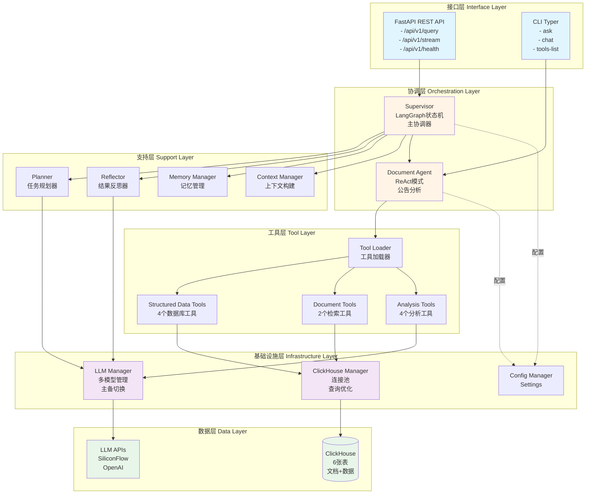
```mermaid
graph TB
    subgraph "接口层 Interface Layer"
        API[FastAPI REST API<br/>- /api/v1/query<br/>- /api/v1/stream<br/>- /api/v1/health]
        CLI[CLI Typer<br/>- ask<br/>- chat<br/>- tools-list]
    end
    
    subgraph "协调层 Orchestration Layer"
        SUP[Supervisor<br/>LangGraph状态机<br/>主协调器]
        DOC[Document Agent<br/>ReAct模式<br/>公告分析]
    end
    
    subgraph "支持层 Support Layer"
        PLN[Planner<br/>任务规划器]
        REF[Reflector<br/>结果反思器]
        MEM[Memory Manager<br/>记忆管理]
        CTX[Context Manager<br/>上下文构建]
    end
    
    subgraph "工具层 Tool Layer"
        TL[Tool Loader<br/>工具加载器]
        ST[Structured Data Tools<br/>4个数据库工具]
        DT[Document Tools<br/>2个检索工具]
        AT[Analysis Tools<br/>4个分析工具]
    end
    
    subgraph "基础设施层 Infrastructure Layer"
        LLM[LLM Manager<br/>多模型管理<br/>主备切换]
        DB[ClickHouse Manager<br/>连接池<br/>查询优化]
        CFG[Config Manager<br/>Settings]
    end
    
    subgraph "数据层 Data Layer"
        CH[(ClickHouse<br/>6张表<br/>文档+数据)]
        LLMAPI[LLM APIs<br/>SiliconFlow<br/>OpenAI]
    end
    
    %% 连接关系
    API --> SUP
    CLI --> DOC
    
    SUP --> PLN
    SUP --> REF
    SUP --> MEM
    SUP --> CTX
    SUP --> DOC
    
    DOC --> TL
    PLN --> LLM
    REF --> LLM
    
    TL --> ST
    TL --> DT
    TL --> AT
    
    ST --> DB
    DT --> DB
    AT --> LLM
    
    DB --> CH
    LLM --> LLMAPI
    
    SUP -.配置.-> CFG
    DOC -.配置.-> CFG
    
    style API fill:#e1f5ff
    style CLI fill:#e1f5ff
    style SUP fill:#fff4e6
    style DOC fill:#fff4e6
    style LLM fill:#f3e5f5
    style DB fill:#f3e5f5
    style CH fill:#e8f5e9
    style LLMAPI fill:#e8f5e9
```

---

## 2. 数据流图

### 2.1 完整查询流程

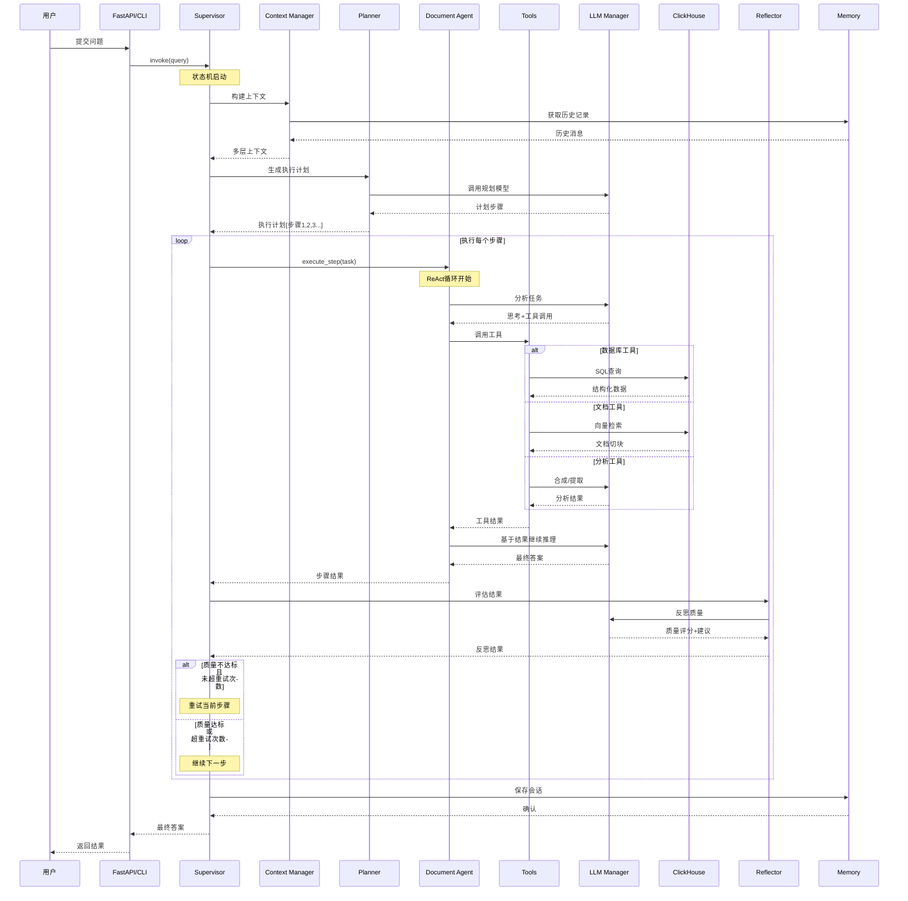
```mermaid
sequenceDiagram
    participant User as 用户
    participant API as FastAPI/CLI
    participant SUP as Supervisor
    participant CTX as Context Manager
    participant PLN as Planner
    participant DOC as Document Agent
    participant Tools as Tools
    participant LLM as LLM Manager
    participant DB as ClickHouse
    participant REF as Reflector
    participant MEM as Memory
    
    User->>API: 提交问题
    API->>SUP: invoke(query)
    
    Note over SUP: 状态机启动
    
    SUP->>CTX: 构建上下文
    CTX->>MEM: 获取历史记录
    MEM-->>CTX: 历史消息
    CTX-->>SUP: 多层上下文
    
    SUP->>PLN: 生成执行计划
    PLN->>LLM: 调用规划模型
    LLM-->>PLN: 计划步骤
    PLN-->>SUP: 执行计划[步骤1,2,3...]
    
    loop 执行每个步骤
        SUP->>DOC: execute_step(task)
        
        Note over DOC: ReAct循环开始
        
        DOC->>LLM: 分析任务
        LLM-->>DOC: 思考+工具调用
        
        DOC->>Tools: 调用工具
        alt 数据库工具
            Tools->>DB: SQL查询
            DB-->>Tools: 结构化数据
        else 文档工具
            Tools->>DB: 向量检索
            DB-->>Tools: 文档切块
        else 分析工具
            Tools->>LLM: 合成/提取
            LLM-->>Tools: 分析结果
        end
        Tools-->>DOC: 工具结果
        
        DOC->>LLM: 基于结果继续推理
        LLM-->>DOC: 最终答案
        
        DOC-->>SUP: 步骤结果
        
        SUP->>REF: 评估结果
        REF->>LLM: 反思质量
        LLM-->>REF: 质量评分+建议
        REF-->>SUP: 反思结果
        
        alt 质量不达标 且 未超重试次数
            Note over SUP: 重试当前步骤
        else 质量达标 或 超重试次数
            Note over SUP: 继续下一步
        end
    end
    
    SUP->>MEM: 保存会话
    MEM-->>SUP: 确认
    
    SUP-->>API: 最终答案
    API-->>User: 返回结果
```

### 2.2 流式查询数据流

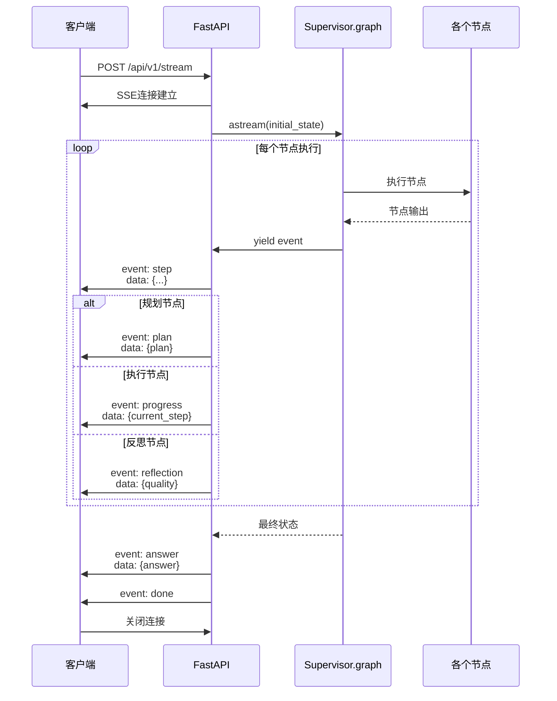
```mermaid
sequenceDiagram
    participant Client as 客户端
    participant API as FastAPI
    participant SUP as Supervisor.graph
    participant Nodes as 各个节点
    
    Client->>API: POST /api/v1/stream
    API->>Client: SSE连接建立
    
    API->>SUP: astream(initial_state)
    
    loop 每个节点执行
        SUP->>Nodes: 执行节点
        Nodes-->>SUP: 节点输出
        
        SUP->>API: yield event
        API->>Client: event: step<br/>data: {...}
        
        alt 规划节点
            API->>Client: event: plan<br/>data: {plan}
        else 执行节点
            API->>Client: event: progress<br/>data: {current_step}
        else 反思节点
            API->>Client: event: reflection<br/>data: {quality}
        end
    end
    
    SUP-->>API: 最终状态
    API->>Client: event: answer<br/>data: {answer}
    API->>Client: event: done
    
    Client->>API: 关闭连接
```

---

## 3. Supervisor状态机流程图

### 3.1 LangGraph状态机节点

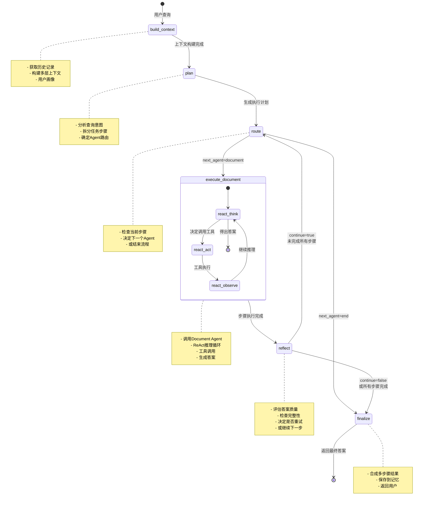
```mermaid
stateDiagram-v2
    [*] --> build_context: 用户查询
    
    build_context --> plan: 上下文构建完成
    note right of build_context
        - 获取历史记录
        - 构建多层上下文
        - 用户画像
    end note
    
    plan --> route: 生成执行计划
    note right of plan
        - 分析查询意图
        - 拆分任务步骤
        - 确定Agent路由
    end note
    
    route --> execute_document: next_agent=document
    route --> finalize: next_agent=end
    
    note right of route
        - 检查当前步骤
        - 决定下一个Agent
        - 或结束流程
    end note
    
    execute_document --> reflect: 步骤执行完成
    note right of execute_document
        - 调用Document Agent
        - ReAct推理循环
        - 工具调用
        - 生成答案
    end note
    
    reflect --> route: continue=true<br/>未完成所有步骤
    reflect --> finalize: continue=false<br/>或所有步骤完成
    
    note right of reflect
        - 评估答案质量
        - 检查完整性
        - 决定是否重试
        - 或继续下一步
    end note
    
    finalize --> [*]: 返回最终答案
    note right of finalize
        - 合成多步骤结果
        - 保存到记忆
        - 返回用户
    end note
    
    state execute_document {
        [*] --> react_think
        react_think --> react_act: 决定调用工具
        react_act --> react_observe: 工具执行
        react_observe --> react_think: 继续推理
        react_think --> [*]: 得出答案
    }
```

### 3.2 状态转换条件

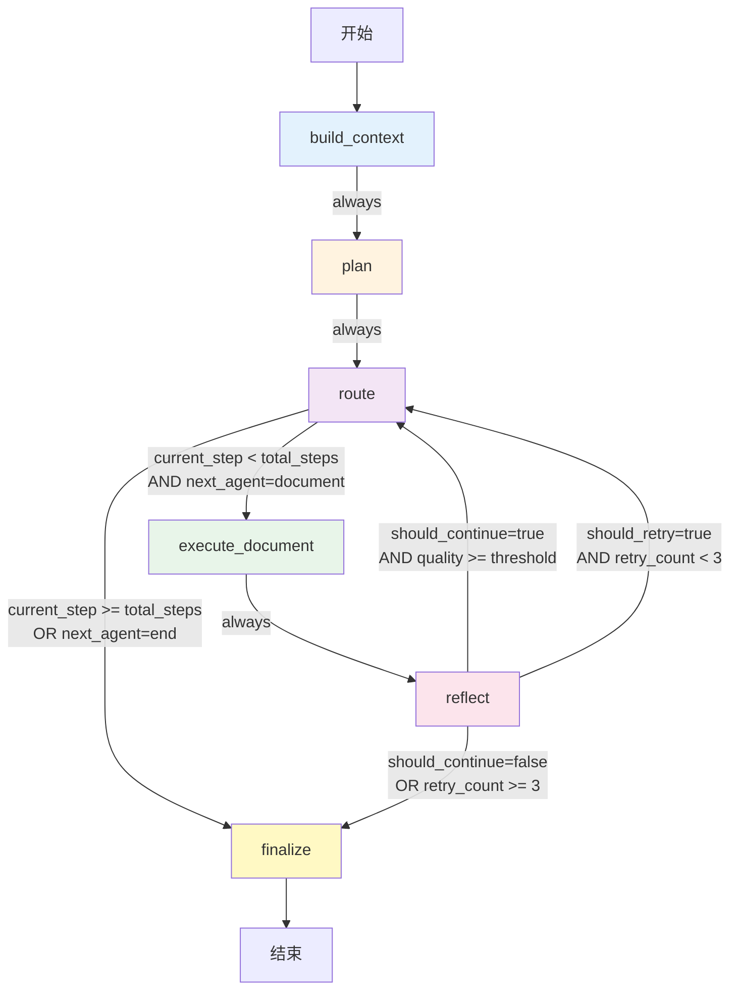
```mermaid
graph TD
    Start[开始] --> BC[build_context]
    BC --> |always| Plan[plan]
    Plan --> |always| Route[route]
    
    Route --> |current_step < total_steps<br/>AND next_agent=document| ExecDoc[execute_document]
    Route --> |current_step >= total_steps<br/>OR next_agent=end| Final[finalize]
    
    ExecDoc --> |always| Reflect[reflect]
    
    Reflect --> |should_continue=true<br/>AND quality >= threshold| Route
    Reflect --> |should_retry=true<br/>AND retry_count < 3| Route
    Reflect --> |should_continue=false<br/>OR retry_count >= 3| Final
    
    Final --> End[结束]
    
    style BC fill:#e3f2fd
    style Plan fill:#fff3e0
    style Route fill:#f3e5f5
    style ExecDoc fill:#e8f5e9
    style Reflect fill:#fce4ec
    style Final fill:#fff9c4
```

---

## 4. 组件依赖关系图

### 4.1 模块依赖图

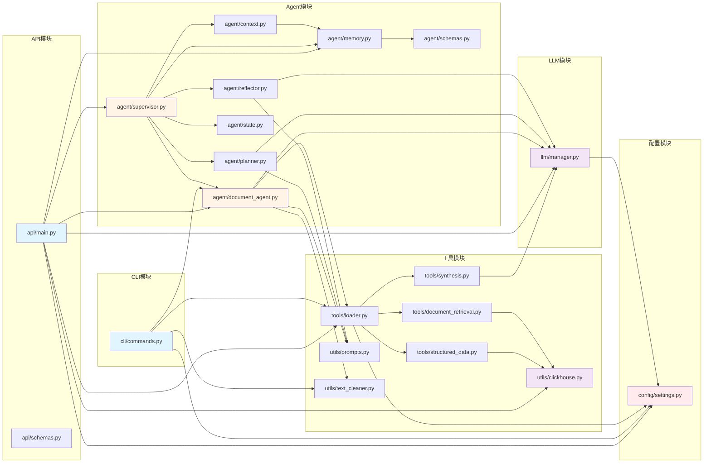
```mermaid
graph LR
    subgraph "API模块"
        API[api/main.py]
        SCHEMAS[api/schemas.py]
    end
    
    subgraph "CLI模块"
        CLI[cli/commands.py]
    end
    
    subgraph "Agent模块"
        SUP[agent/supervisor.py]
        DOC[agent/document_agent.py]
        PLN[agent/planner.py]
        REF[agent/reflector.py]
        MEM[agent/memory.py]
        CTX[agent/context.py]
        STATE[agent/state.py]
        ASCHEMAS[agent/schemas.py]
    end
    
    subgraph "工具模块"
        LOADER[tools/loader.py]
        STRUCT[tools/structured_data.py]
        DOCTOOLS[tools/document_retrieval.py]
        SYNTH[tools/synthesis.py]
    end
    
    subgraph "LLM模块"
        LLMM[llm/manager.py]
    end
    
    subgraph "配置模块"
        SETTINGS[config/settings.py]
    end
    
    subgraph "工具模块"
        CHM[utils/clickhouse.py]
        PROMPTS[utils/prompts.py]
        CLEANER[utils/text_cleaner.py]
    end
    
    %% API依赖
    API --> SUP
    API --> DOC
    API --> MEM
    API --> LOADER
    API --> CHM
    API --> LLMM
    API --> SETTINGS
    
    %% CLI依赖
    CLI --> DOC
    CLI --> LOADER
    CLI --> SETTINGS
    CLI --> CLEANER
    
    %% Supervisor依赖
    SUP --> DOC
    SUP --> PLN
    SUP --> REF
    SUP --> MEM
    SUP --> CTX
    SUP --> STATE
    
    %% Document Agent依赖
    DOC --> LLMM
    DOC --> LOADER
    DOC --> PROMPTS
    DOC --> CLEANER
    
    %% Planner依赖
    PLN --> LLMM
    PLN --> PROMPTS
    
    %% Reflector依赖
    REF --> LLMM
    REF --> PROMPTS
    
    %% Memory依赖
    MEM --> ASCHEMAS
    
    %% Context依赖
    CTX --> MEM
    
    %% Loader依赖
    LOADER --> SETTINGS
    LOADER --> STRUCT
    LOADER --> DOCTOOLS
    LOADER --> SYNTH
    
    %% Tools依赖
    STRUCT --> CHM
    DOCTOOLS --> CHM
    SYNTH --> LLMM
    
    %% LLM Manager依赖
    LLMM --> SETTINGS
    
    style API fill:#e1f5ff
    style CLI fill:#e1f5ff
    style SUP fill:#fff4e6
    style DOC fill:#fff4e6
    style LLMM fill:#f3e5f5
    style CHM fill:#f3e5f5
    style SETTINGS fill:#ffebee
```

---

## 5. 技术栈分层架构

### 5.1 技术栈全景图

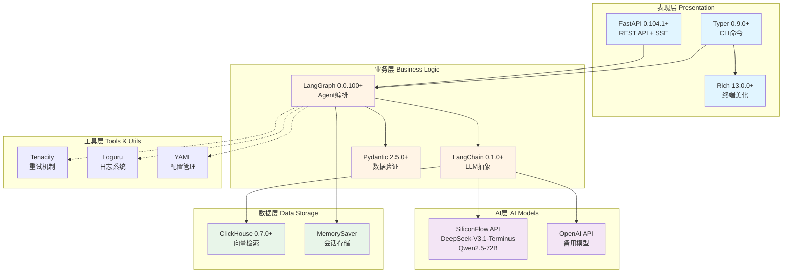
```mermaid
graph TB
    subgraph "表现层 Presentation"
        P1[FastAPI 0.104.1+<br/>REST API + SSE]
        P2[Typer 0.9.0+<br/>CLI命令]
        P3[Rich 13.0.0+<br/>终端美化]
    end
    
    subgraph "业务层 Business Logic"
        B1[LangGraph 0.0.100+<br/>Agent编排]
        B2[LangChain 0.1.0+<br/>LLM抽象]
        B3[Pydantic 2.5.0+<br/>数据验证]
    end
    
    subgraph "AI层 AI Models"
        A1[SiliconFlow API<br/>DeepSeek-V3.1-Terminus<br/>Qwen2.5-72B]
        A2[OpenAI API<br/>备用模型]
    end
    
    subgraph "数据层 Data Storage"
        D1[ClickHouse 0.7.0+<br/>向量检索]
        D2[MemorySaver<br/>会话存储]
    end
    
    subgraph "工具层 Tools & Utils"
        T1[Tenacity<br/>重试机制]
        T2[Loguru<br/>日志系统]
        T3[YAML<br/>配置管理]
    end
    
    P1 --> B1
    P2 --> B1
    P2 --> P3
    
    B1 --> B2
    B1 --> B3
    B2 --> A1
    B2 --> A2
    B1 --> D2
    
    B2 --> D1
    
    B1 -.-> T1
    B1 -.-> T2
    B1 -.-> T3
    
    style P1 fill:#e1f5ff
    style P2 fill:#e1f5ff
    style P3 fill:#e1f5ff
    style B1 fill:#fff4e6
    style B2 fill:#fff4e6
    style B3 fill:#fff4e6
    style A1 fill:#f3e5f5
    style A2 fill:#f3e5f5
    style D1 fill:#e8f5e9
    style D2 fill:#e8f5e9
```

### 5.2 框架依赖关系

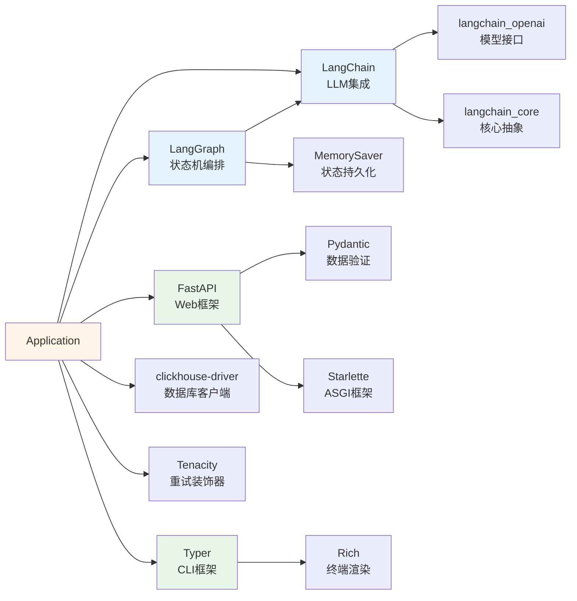
```mermaid
graph LR
    APP[Application]
    
    APP --> LG[LangGraph<br/>状态机编排]
    APP --> LC[LangChain<br/>LLM集成]
    APP --> FA[FastAPI<br/>Web框架]
    APP --> TP[Typer<br/>CLI框架]
    
    LG --> LC
    LG --> MS[MemorySaver<br/>状态持久化]
    
    LC --> OPENAI[langchain_openai<br/>模型接口]
    LC --> CORE[langchain_core<br/>核心抽象]
    
    FA --> PD[Pydantic<br/>数据验证]
    FA --> STARLETTE[Starlette<br/>ASGI框架]
    
    TP --> RICH[Rich<br/>终端渲染]
    
    APP --> CH[clickhouse-driver<br/>数据库客户端]
    APP --> TEN[Tenacity<br/>重试装饰器]
    
    style APP fill:#fff4e6
    style LG fill:#e3f2fd
    style LC fill:#e3f2fd
    style FA fill:#e8f5e9
    style TP fill:#e8f5e9
```

---

## 6. API请求处理流程

### 6.1 同步查询流程 (/api/v1/query)

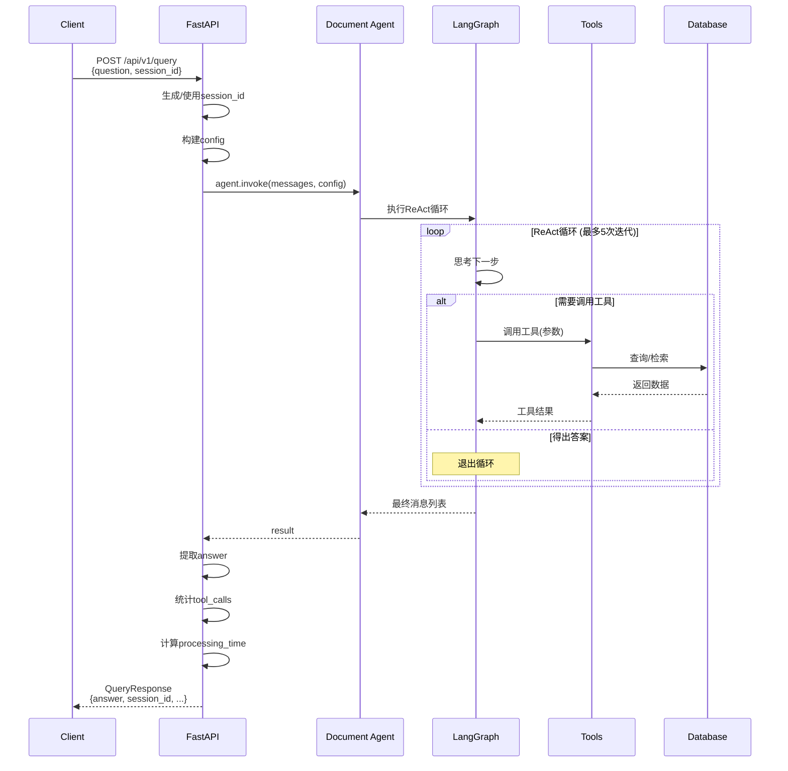
```mermaid
sequenceDiagram
    participant C as Client
    participant F as FastAPI
    participant A as Document Agent
    participant L as LangGraph
    participant T as Tools
    participant D as Database
    
    C->>F: POST /api/v1/query<br/>{question, session_id}
    
    F->>F: 生成/使用session_id
    F->>F: 构建config
    
    F->>A: agent.invoke(messages, config)
    
    A->>L: 执行ReAct循环
    
    loop ReAct循环 (最多5次迭代)
        L->>L: 思考下一步
        
        alt 需要调用工具
            L->>T: 调用工具(参数)
            T->>D: 查询/检索
            D-->>T: 返回数据
            T-->>L: 工具结果
        else 得出答案
            Note over L: 退出循环
        end
    end
    
    L-->>A: 最终消息列表
    A-->>F: result
    
    F->>F: 提取answer
    F->>F: 统计tool_calls
    F->>F: 计算processing_time
    
    F-->>C: QueryResponse<br/>{answer, session_id, ...}
```

### 6.2 流式查询流程 (/api/v1/stream)

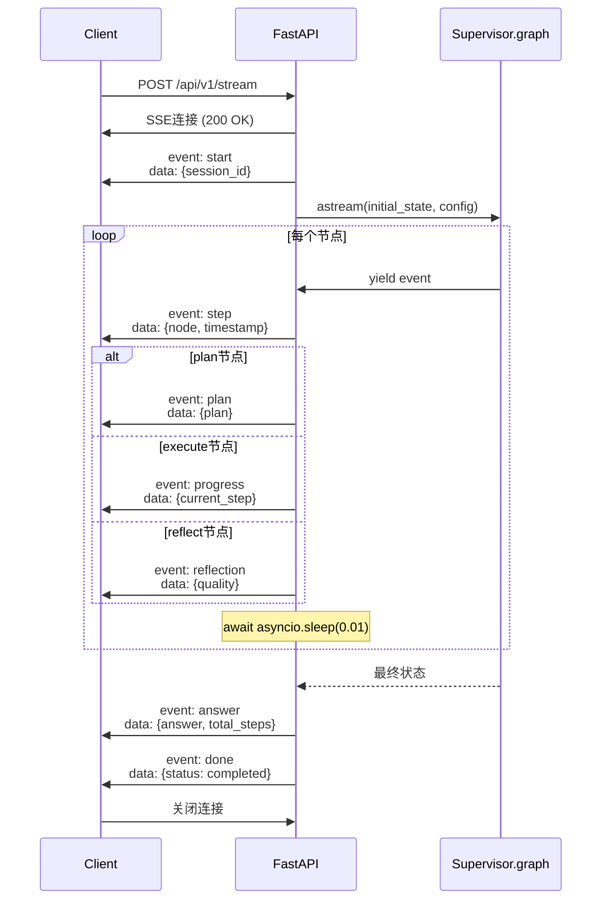
```mermaid
sequenceDiagram
    participant C as Client
    participant F as FastAPI
    participant S as Supervisor.graph
    
    C->>F: POST /api/v1/stream
    F->>C: SSE连接 (200 OK)
    F->>C: event: start<br/>data: {session_id}
    
    F->>S: astream(initial_state, config)
    
    loop 每个节点
        S->>F: yield event
        
        F->>C: event: step<br/>data: {node, timestamp}
        
        alt plan节点
            F->>C: event: plan<br/>data: {plan}
        else execute节点
            F->>C: event: progress<br/>data: {current_step}
        else reflect节点
            F->>C: event: reflection<br/>data: {quality}
        end
        
        Note over F: await asyncio.sleep(0.01)
    end
    
    S-->>F: 最终状态
    F->>C: event: answer<br/>data: {answer, total_steps}
    F->>C: event: done<br/>data: {status: completed}
    
    C->>F: 关闭连接
```

### 6.3 会话历史流程 (/api/v1/sessions/{id}/history)

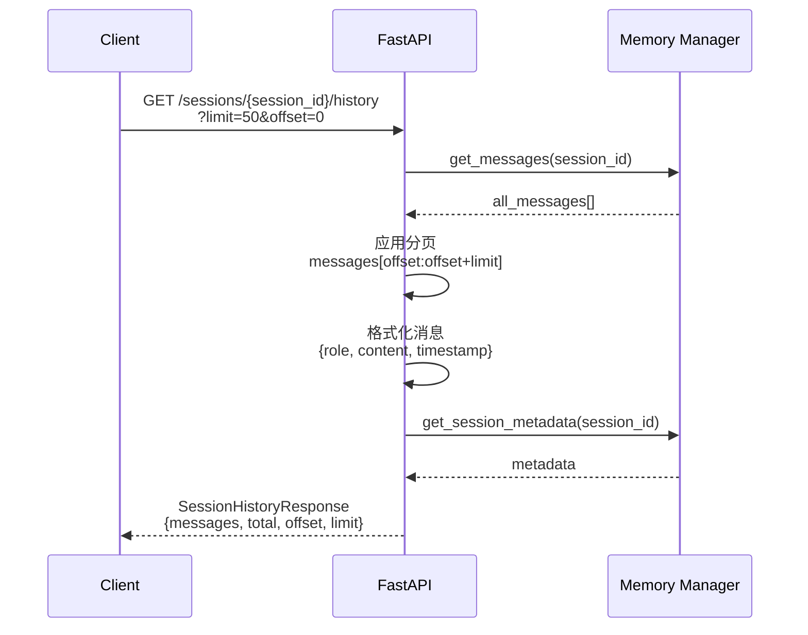
```mermaid
sequenceDiagram
    participant C as Client
    participant F as FastAPI
    participant M as Memory Manager
    
    C->>F: GET /sessions/{session_id}/history<br/>?limit=50&offset=0
    
    F->>M: get_messages(session_id)
    M-->>F: all_messages[]
    
    F->>F: 应用分页<br/>messages[offset:offset+limit]
    
    F->>F: 格式化消息<br/>{role, content, timestamp}
    
    F->>M: get_session_metadata(session_id)
    M-->>F: metadata
    
    F-->>C: SessionHistoryResponse<br/>{messages, total, offset, limit}
```

---

## 7. 工具系统架构

### 7.1 工具加载机制

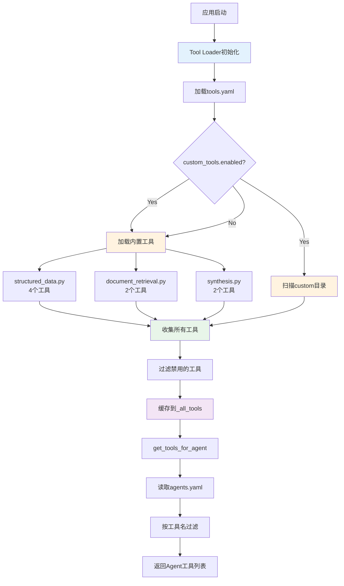
```mermaid
graph TD
    Start[应用启动] --> TL[Tool Loader初始化]
    
    TL --> LoadConfig[加载tools.yaml]
    LoadConfig --> CheckEnabled{custom_tools.enabled?}
    
    CheckEnabled --> |Yes| LoadBuiltin[加载内置工具]
    CheckEnabled --> |No| LoadBuiltin
    
    LoadBuiltin --> SD[structured_data.py<br/>4个工具]
    LoadBuiltin --> DR[document_retrieval.py<br/>2个工具]
    LoadBuiltin --> SY[synthesis.py<br/>2个工具]
    
    SD --> Collect[收集所有工具]
    DR --> Collect
    SY --> Collect
    
    CheckEnabled --> |Yes| LoadCustom[扫描custom目录]
    LoadCustom --> Collect
    
    Collect --> Filter[过滤禁用的工具]
    Filter --> Cache[缓存到_all_tools]
    
    Cache --> GetByAgent[get_tools_for_agent]
    GetByAgent --> AgentConfig[读取agents.yaml]
    AgentConfig --> FilterByName[按工具名过滤]
    FilterByName --> Return[返回Agent工具列表]
    
    style TL fill:#e3f2fd
    style LoadBuiltin fill:#fff3e0
    style LoadCustom fill:#fff3e0
    style Collect fill:#e8f5e9
    style Cache fill:#f3e5f5
```

### 7.2 工具分类与功能

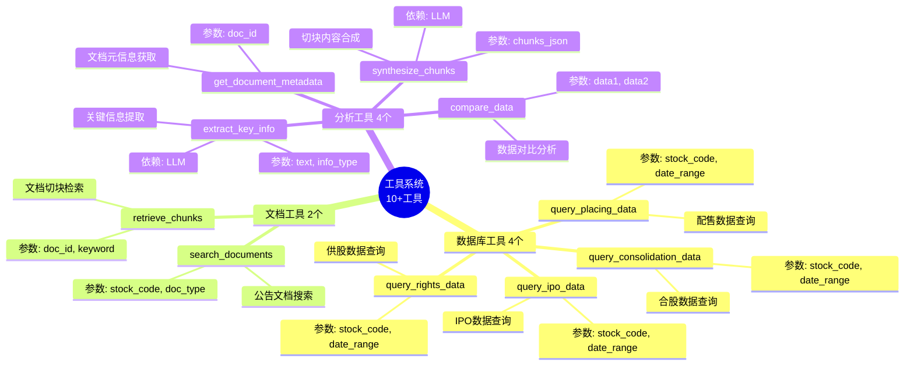
```mermaid
mindmap
  root((工具系统<br/>10+工具))
    数据库工具 4个
      query_ipo_data
        IPO数据查询
        参数: stock_code, date_range
      query_placing_data
        配售数据查询
        参数: stock_code, date_range
      query_rights_data
        供股数据查询
        参数: stock_code, date_range
      query_consolidation_data
        合股数据查询
        参数: stock_code, date_range
    
    文档工具 2个
      search_documents
        公告文档搜索
        参数: stock_code, doc_type
      retrieve_chunks
        文档切块检索
        参数: doc_id, keyword
    
    分析工具 4个
      synthesize_chunks
        切块内容合成
        参数: chunks_json
        依赖: LLM
      extract_key_info
        关键信息提取
        参数: text, info_type
        依赖: LLM
      compare_data
        数据对比分析
        参数: data1, data2
      get_document_metadata
        文档元信息获取
        参数: doc_id
```

### 7.3 工具执行流程

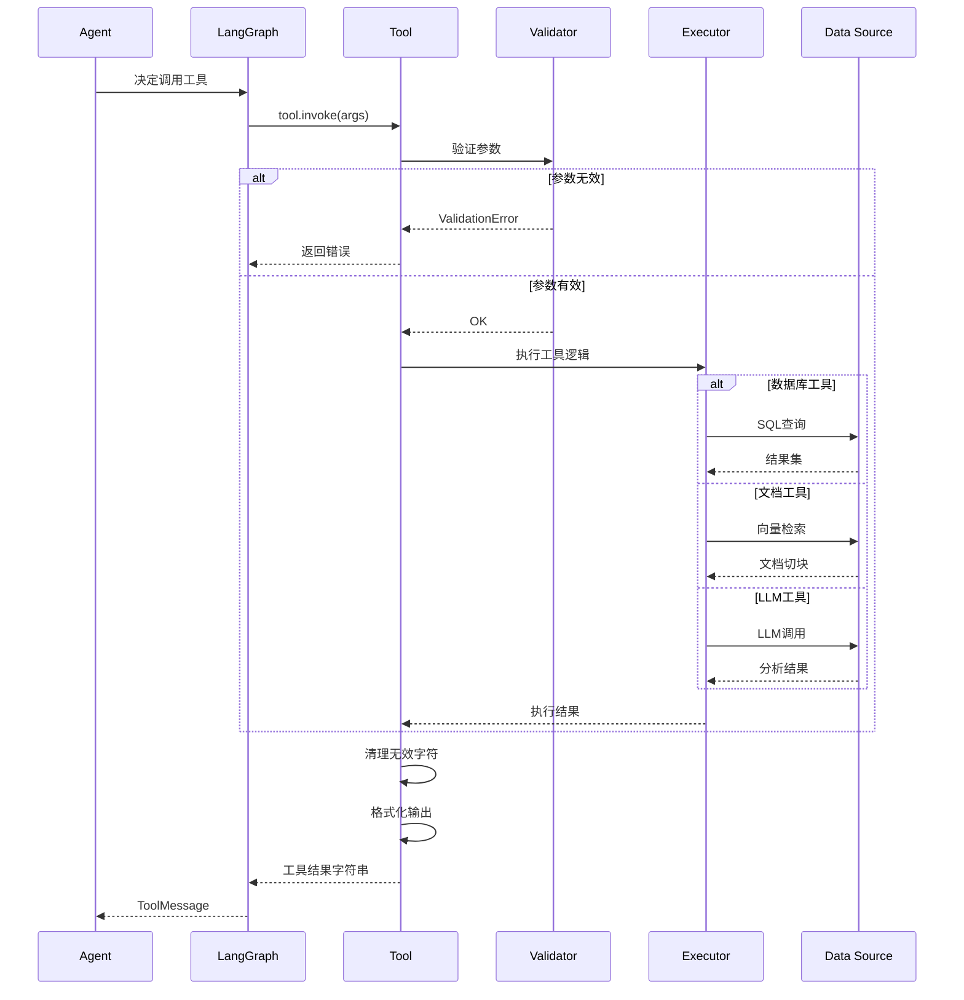
```mermaid
sequenceDiagram
    participant A as Agent
    participant L as LangGraph
    participant T as Tool
    participant V as Validator
    participant E as Executor
    participant D as Data Source
    
    A->>L: 决定调用工具
    L->>T: tool.invoke(args)
    
    T->>V: 验证参数
    alt 参数无效
        V-->>T: ValidationError
        T-->>L: 返回错误
    else 参数有效
        V-->>T: OK
        
        T->>E: 执行工具逻辑
        
        alt 数据库工具
            E->>D: SQL查询
            D-->>E: 结果集
        else 文档工具
            E->>D: 向量检索
            D-->>E: 文档切块
        else LLM工具
            E->>D: LLM调用
            D-->>E: 分析结果
        end
        
        E-->>T: 执行结果
    end
    
    T->>T: 清理无效字符
    T->>T: 格式化输出
    T-->>L: 工具结果字符串
    L-->>A: ToolMessage
```

---

## 8. 数据库表结构

### 8.1 ClickHouse表关系

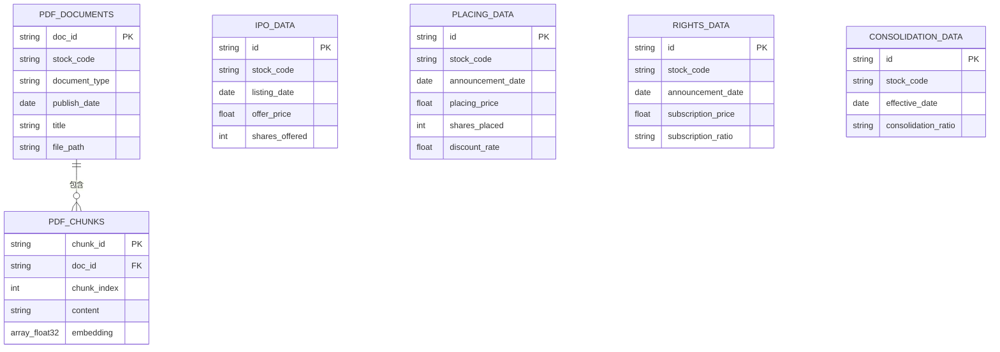
```mermaid
erDiagram
    PDF_DOCUMENTS ||--o{ PDF_CHUNKS : "包含"
    PDF_DOCUMENTS {
        string doc_id PK
        string stock_code
        string document_type
        date publish_date
        string title
        string file_path
    }
    
    PDF_CHUNKS {
        string chunk_id PK
        string doc_id FK
        int chunk_index
        string content
        array_float32 embedding
    }
    
    IPO_DATA {
        string id PK
        string stock_code
        date listing_date
        float offer_price
        int shares_offered
    }
    
    PLACING_DATA {
        string id PK
        string stock_code
        date announcement_date
        float placing_price
        int shares_placed
        float discount_rate
    }
    
    RIGHTS_DATA {
        string id PK
        string stock_code
        date announcement_date
        float subscription_price
        string subscription_ratio
    }
    
    CONSOLIDATION_DATA {
        string id PK
        string stock_code
        date effective_date
        string consolidation_ratio
    }
```

### 8.2 表用途说明

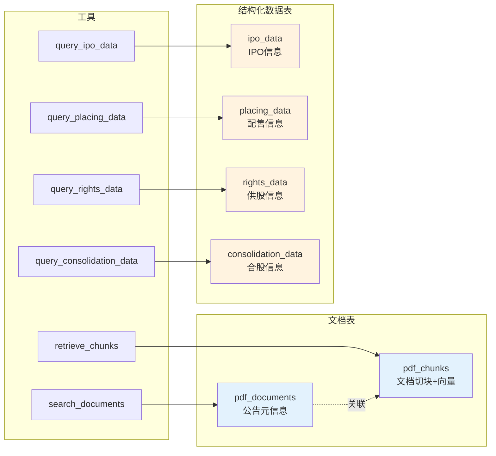
```mermaid
graph LR
    subgraph "文档表"
        PDOC[pdf_documents<br/>公告元信息]
        PCHUNK[pdf_chunks<br/>文档切块+向量]
    end
    
    subgraph "结构化数据表"
        IPO[ipo_data<br/>IPO信息]
        PLC[placing_data<br/>配售信息]
        RGT[rights_data<br/>供股信息]
        CSL[consolidation_data<br/>合股信息]
    end
    
    subgraph "工具"
        SEARCH[search_documents]
        RETRIEVE[retrieve_chunks]
        QIPO[query_ipo_data]
        QPLC[query_placing_data]
        QRGT[query_rights_data]
        QCSL[query_consolidation_data]
    end
    
    SEARCH --> PDOC
    RETRIEVE --> PCHUNK
    QIPO --> IPO
    QPLC --> PLC
    QRGT --> RGT
    QCSL --> CSL
    
    PDOC -.关联.-> PCHUNK
    
    style PDOC fill:#e3f2fd
    style PCHUNK fill:#e3f2fd
    style IPO fill:#fff3e0
    style PLC fill:#fff3e0
    style RGT fill:#fff3e0
    style CSL fill:#fff3e0
```

---

## 9. 部署架构

### 9.1 生产部署示意图

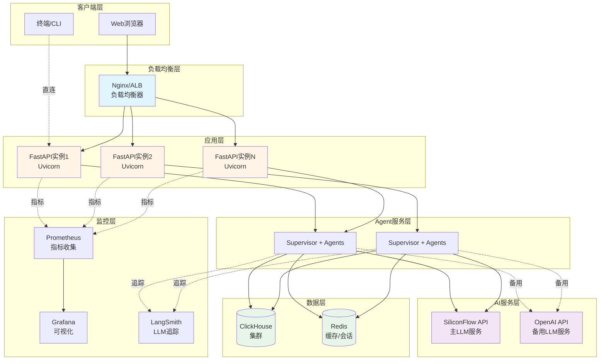
```mermaid
graph TB
    subgraph "客户端层"
        WEB[Web浏览器]
        TERM[终端/CLI]
    end
    
    subgraph "负载均衡层"
        LB[Nginx/ALB<br/>负载均衡器]
    end
    
    subgraph "应用层"
        API1[FastAPI实例1<br/>Uvicorn]
        API2[FastAPI实例2<br/>Uvicorn]
        API3[FastAPI实例N<br/>Uvicorn]
    end
    
    subgraph "Agent服务层"
        SUP1[Supervisor + Agents]
        SUP2[Supervisor + Agents]
    end
    
    subgraph "AI服务层"
        SF[SiliconFlow API<br/>主LLM服务]
        OAI[OpenAI API<br/>备用LLM服务]
    end
    
    subgraph "数据层"
        CH[(ClickHouse<br/>集群)]
        REDIS[(Redis<br/>缓存/会话)]
    end
    
    subgraph "监控层"
        PROM[Prometheus<br/>指标收集]
        GRAF[Grafana<br/>可视化]
        LS[LangSmith<br/>LLM追踪]
    end
    
    WEB --> LB
    TERM -.直连.-> API1
    
    LB --> API1
    LB --> API2
    LB --> API3
    
    API1 --> SUP1
    API2 --> SUP2
    API3 --> SUP1
    
    SUP1 --> SF
    SUP1 -.备用.-> OAI
    SUP2 --> SF
    SUP2 -.备用.-> OAI
    
    SUP1 --> CH
    SUP2 --> CH
    SUP1 --> REDIS
    SUP2 --> REDIS
    
    API1 -.指标.-> PROM
    API2 -.指标.-> PROM
    API3 -.指标.-> PROM
    
    PROM --> GRAF
    SUP1 -.追踪.-> LS
    SUP2 -.追踪.-> LS
    
    style LB fill:#e1f5ff
    style API1 fill:#fff4e6
    style API2 fill:#fff4e6
    style API3 fill:#fff4e6
    style SF fill:#f3e5f5
    style OAI fill:#f3e5f5
    style CH fill:#e8f5e9
    style REDIS fill:#e8f5e9
```

### 9.2 容器化部署

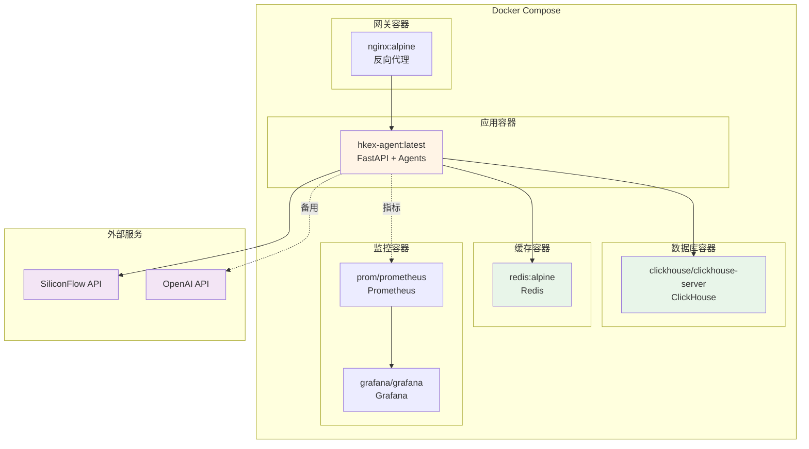
```mermaid
graph TB
    subgraph "Docker Compose"
        subgraph "应用容器"
            APP[hkex-agent:latest<br/>FastAPI + Agents]
        end
        
        subgraph "数据库容器"
            CH[clickhouse/clickhouse-server<br/>ClickHouse]
        end
        
        subgraph "缓存容器"
            RD[redis:alpine<br/>Redis]
        end
        
        subgraph "监控容器"
            PROM[prom/prometheus<br/>Prometheus]
            GRAF[grafana/grafana<br/>Grafana]
        end
        
        subgraph "网关容器"
            NGX[nginx:alpine<br/>反向代理]
        end
    end
    
    NGX --> APP
    APP --> CH
    APP --> RD
    APP -.指标.-> PROM
    PROM --> GRAF
    
    subgraph "外部服务"
        SF[SiliconFlow API]
        OAI[OpenAI API]
    end
    
    APP --> SF
    APP -.备用.-> OAI
    
    style APP fill:#fff4e6
    style CH fill:#e8f5e9
    style RD fill:#e8f5e9
    style SF fill:#f3e5f5
    style OAI fill:#f3e5f5
```

---

## 10. 关键技术决策

### 10.1 架构决策记录 (ADR)

| 决策点     | 选择                       | 理由             | 替代方案                    |
|---------|--------------------------|----------------|-------------------------|
| Agent框架 | LangGraph                | 状态机清晰、可视化好、易调试 | LangChain Agents (太简单)  |
| Agent模式 | ReAct                    | 支持工具调用、推理透明    | Plan-and-Execute (过于复杂) |
| API框架   | FastAPI                  | 异步、高性能、文档自动生成  | Flask (不支持异步)           |
| CLI框架   | Typer + Rich             | 类型安全、终端美化      | Click (功能较少)            |
| 数据库     | ClickHouse               | 列式存储、向量检索、OLAP | PostgreSQL (性能较差)       |
| LLM提供商  | SiliconFlow              | 性价比高、中文支持好     | 直接OpenAI (成本高)          |
| 配置管理    | YAML + Pydantic Settings | 外部化、类型安全       | 硬编码 (不灵活)               |
| 工具加载    | 插件化自动扫描                  | 可扩展、零侵入        | 手动注册 (易遗漏)              |
| 状态管理    | LangGraph Checkpointer   | 会话持久化、可恢复      | 内存 (无持久化)               |
| 重试机制    | Tenacity装饰器              | 声明式、易配置        | 手动try-except (代码冗余)     |

### 10.2 性能优化策略

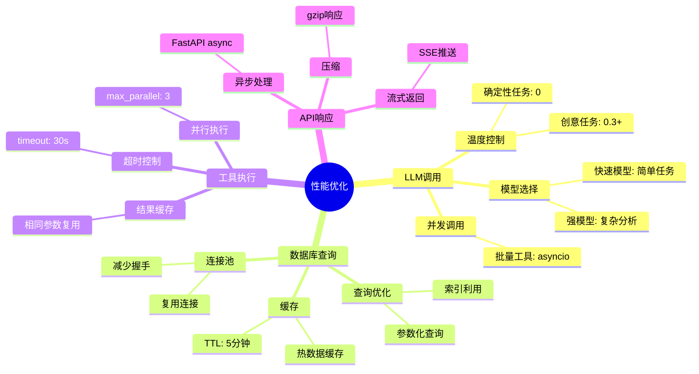
```mermaid
mindmap
  root((性能优化))
    LLM调用
      模型选择
        快速模型: 简单任务
        强模型: 复杂分析
      温度控制
        确定性任务: 0
        创意任务: 0.3+
      并发调用
        批量工具: asyncio
      
    数据库查询
      连接池
        复用连接
        减少握手
      查询优化
        参数化查询
        索引利用
      缓存
        热数据缓存
        TTL: 5分钟
    
    工具执行
      并行执行
        max_parallel: 3
      超时控制
        timeout: 30s
      结果缓存
        相同参数复用
    
    API响应
      流式返回
        SSE推送
      异步处理
        FastAPI async
      压缩
        gzip响应
```

---

## 11. 安全架构

### 11.1 安全层次

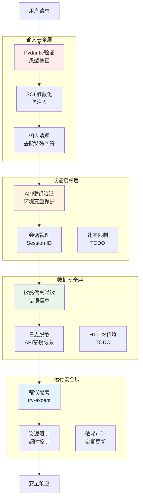
```mermaid
graph TB
    subgraph "输入安全层"
        I1[Pydantic验证<br/>类型检查]
        I2[SQL参数化<br/>防注入]
        I3[输入清理<br/>去除特殊字符]
    end
    
    subgraph "认证授权层"
        A1[API密钥验证<br/>环境变量保护]
        A2[会话管理<br/>Session ID]
        A3[速率限制<br/>TODO]
    end
    
    subgraph "数据安全层"
        D1[敏感信息脱敏<br/>错误信息]
        D2[日志脱敏<br/>API密钥隐藏]
        D3[HTTPS传输<br/>TODO]
    end
    
    subgraph "运行安全层"
        R1[错误隔离<br/>try-except]
        R2[资源限制<br/>超时控制]
        R3[依赖审计<br/>定期更新]
    end
    
    User[用户请求] --> I1
    I1 --> I2
    I2 --> I3
    I3 --> A1
    A1 --> A2
    A2 --> D1
    D1 --> D2
    D2 --> R1
    R1 --> R2
    R2 --> Response[安全响应]
    
    style I1 fill:#ffebee
    style A1 fill:#fff3e0
    style D1 fill:#e8f5e9
    style R1 fill:#e3f2fd
```

---

## 📝 图表说明

### 图例

- 🔵 **蓝色**: 接口层/外部交互
- 🟡 **黄色**: 协调层/核心逻辑
- 🟣 **紫色**: 基础设施/服务
- 🟢 **绿色**: 数据层/存储

### 工具

所有图表使用 **Mermaid** 语法绘制，可在以下环境查看：

- GitHub/GitLab (原生支持)
- VS Code (Markdown Preview Mermaid插件)
- Notion/Obsidian (支持Mermaid)
- 在线工具: https://mermaid.live

---

## 🔄 更新日志

| 日期         | 版本   | 更新内容       |
|------------|------|------------|
| 2025-10-24 | v1.0 | 初始版本，完整架构图 |

---

**维护者**: Development Team  
**最后更新**: 2025-10-24

