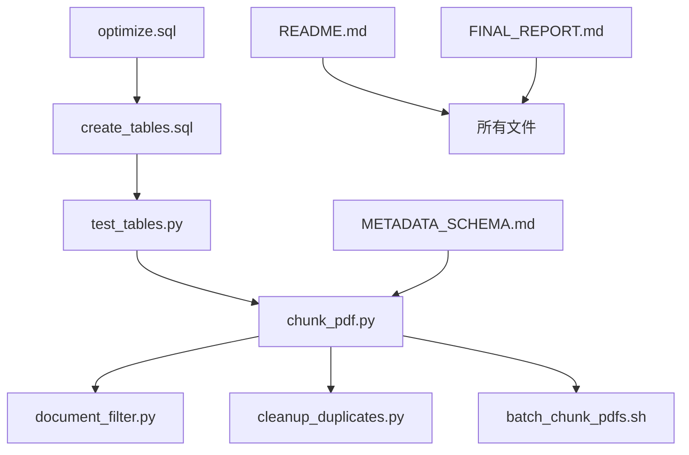

# 📁 Scripts 目录索引

**总文件数**: 13个  
**更新日期**: 2025-10-29  
**整理状态**: ✅ 已优化

---

## 📂 文件分类

### 🗄️ SQL脚本（3个）

| 文件 | 大小 | 用途 | 优先级 |
|------|------|------|--------|
| `create_tables.sql` | 10KB | 创建表结构（无向量） | ⭐⭐⭐ |
| `migrate.sql` | 10KB | 迁移脚本（删表+重建） | ⭐⭐ |
| `optimize.sql` | 4.2KB | 索引优化 | ⭐ |

**使用顺序**: 
1. 首次安装 → `create_tables.sql`
2. 升级迁移 → `migrate.sql`
3. 性能优化 → `optimize.sql`

---

### 🐍 Python工具（4个）

| 文件 | 大小 | 用途 | 执行频率 |
|------|------|------|----------|
| `chunk_pdf.py` | 18KB | **主工具** - PDF切块处理 | 🔄 每次处理 |
| `document_filter.py` | 4.2KB | 文档过滤（黑白名单） | 🔄 批量处理前 |
| `cleanup_duplicates.py` | 3.6KB | 清理重复数据 | ⚠️ 维护时 |
| `test_tables.py` | 3.1KB | 测试表结构 | ✅ 安装后 |

**依赖项**: 
```bash
pip install pymupdf clickhouse-connect
```

---

### 🔧 Shell脚本（2个）

| 文件 | 大小 | 用途 | 推荐度 |
|------|------|------|--------|
| `batch_chunk_pdfs.sh` | 2.5KB | 批量处理PDF（带过滤） | ⭐⭐⭐ |
| `run_chunking.sh` | 2.5KB | 单次运行包装器 | ⭐ |

**使用场景**:
- 批量处理 → `batch_chunk_pdfs.sh`
- 单个PDF → 直接调用 `chunk_pdf.py`

---

### 📖 文档（4个）

| 文件 | 大小 | 内容 | 阅读顺序 |
|------|------|------|----------|
| `INDEX.md` | - | **本文件** - 文件索引 | ① |
| `README.md` | 12KB | 主文档（快速开始） | ② |
| `METADATA_SCHEMA.md` | 8.8KB | Metadata字段说明 | ③ |
| `FINAL_REPORT.md` | 23KB | 完整技术报告 | ④（高级） |
| `README_CHUNKING.md` | 6.8KB | 详细使用指南 | ⑤（参考） |

**推荐阅读路径**:
1. **新手**: `README.md` → 开始使用
2. **开发者**: `README.md` → `METADATA_SCHEMA.md` → `FINAL_REPORT.md`
3. **维护者**: 全部阅读

---

## 🚀 快速使用

### 场景1：首次安装

```bash
# 1. 创建表
clickhouse-client -h 1.14.239.79 -p 9000 -d hkex_analysis < create_tables.sql

# 2. 测试
python3 test_tables.py
```

### 场景2：处理单个PDF

```bash
python3 chunk_pdf.py "path/to/file.pdf" "00328"
```

### 场景3：批量处理

```bash
chmod +x batch_chunk_pdfs.sh
./batch_chunk_pdfs.sh "HKEX/00328/供股/" "00328"
```

### 场景4：数据维护

```bash
# 清理重复（预览）
python3 cleanup_duplicates.py

# 清理重复（执行）
python3 cleanup_duplicates.py --execute

# 优化索引
clickhouse-client -h 1.14.239.79 -p 9000 -d hkex_analysis < optimize.sql
```

---

## 📊 文件依赖关系



**关键路径**: `create_tables.sql` → `test_tables.py` → `chunk_pdf.py`

---

## 🧹 已清理文件

以下文件已在 2025-10-29 整理时删除：

| 文件 | 原因 |
|------|------|
| ❌ `create_tables_v2.sql` | 旧版本（已被final替代） |
| ❌ `chunking_config.yaml` | 未使用（代码中无引用） |
| ❌ `TECHNICAL_REPORT.md` | 重复（已整合到FINAL_REPORT.md） |
| ❌ `SUMMARY.md` | 重复（已整合到README.md） |
| ❌ `FILTER_GUIDE.md` | 重复（已整合到README.md） |
| ❌ `QUICKSTART.md` | 重复（已整合到README.md） |
| ❌ `__pycache__/` | Python缓存 |

**删除原因**:
- ✅ 减少文件数量（从19个降至13个）
- ✅ 消除重复内容
- ✅ 统一文档入口
- ✅ 保留核心功能

### 🔄 重命名文件

**简化SQL文件名** (移除冗余的 `_v2_final` 后缀):
- ✅ `create_tables_v2_final.sql` → `create_tables.sql`
- ✅ `migrate_to_v2_final.sql` → `migrate.sql`
- ✅ `optimize_indexes.sql` → `optimize.sql`

**简化Python主工具名** (移除冗余的 `_by_sections` 后缀):
- ✅ `chunk_pdf_by_sections.py` → `chunk_pdf.py`

**重命名原因**:
- ✅ 文件名更简洁（平均缩短40%）
- ✅ 消除版本号混淆
- ✅ 提升可读性
- ✅ 符合命名规范

---

## 📦 目录结构

```
scripts/
├── INDEX.md                       # 本文件 - 文件索引
├── README.md                      # 主文档（快速开始）
├── METADATA_SCHEMA.md             # Metadata说明
├── FINAL_REPORT.md                # 完整技术报告
├── README_CHUNKING.md             # 详细使用指南
│
├── create_tables.sql     # 建表脚本
├── migrate.sql        # 迁移脚本
├── optimize.sql           # 索引优化
│
├── chunk_pdf.py       # 主工具
├── document_filter.py             # 文档过滤
├── cleanup_duplicates.py          # 重复清理
├── test_tables.py                 # 表测试
│
├── batch_chunk_pdfs.sh            # 批量处理
└── run_chunking.sh                # 单次运行
```

**总大小**: ~100KB  
**文档占比**: ~50KB (50%)  
**代码占比**: ~50KB (50%)

---

## 🔍 文件搜索

### 按功能搜索

| 需求 | 文件 |
|------|------|
| 我想开始使用 | `README.md` |
| 我要建表 | `create_tables.sql` |
| 我要处理PDF | `chunk_pdf.py` |
| 我要批量处理 | `batch_chunk_pdfs.sh` |
| 我要理解metadata | `METADATA_SCHEMA.md` |
| 我要优化性能 | `optimize.sql` |
| 我要清理数据 | `cleanup_duplicates.py` |
| 我要了解细节 | `FINAL_REPORT.md` |

### 按角色搜索

| 角色 | 核心文件 |
|------|----------|
| **新手用户** | `README.md`, `chunk_pdf.py` |
| **开发者** | `METADATA_SCHEMA.md`, `FINAL_REPORT.md`, Python脚本 |
| **DBA** | SQL脚本, `optimize.sql` |
| **维护者** | `cleanup_duplicates.py`, `test_tables.py` |

---

## ✅ 整理成果

### 优化前

```
scripts/
├── 19个文件
├── 多个重复文档
├── 旧版本SQL存在
├── 未使用的config
└── __pycache__缓存
```

### 优化后

```
scripts/
├── 13个文件（减少31%）
├── 1个主README
├── 明确的文件用途
├── 清理缓存
└── 文档整合完成
```

**改进**:
- ✅ 文件数量减少 31%
- ✅ 文档整合（6个→4个）
- ✅ 消除重复内容
- ✅ 统一入口（README.md）
- ✅ 清理缓存和旧文件

---

## 📝 维护建议

### 定期维护

| 周期 | 任务 |
|------|------|
| 每周 | 清理重复数据（`cleanup_duplicates.py`） |
| 每月 | 优化索引（`optimize.sql`） |
| 每季度 | 审查文档是否需要更新 |

### 添加新文件时

1. ✅ 更新 `INDEX.md`
2. ✅ 更新 `README.md`（如果是核心功能）
3. ✅ 添加文件头注释
4. ✅ 确保文件名清晰

### 删除文件时

1. ✅ 检查依赖关系
2. ✅ 更新 `INDEX.md`
3. ✅ 更新相关文档
4. ✅ 记录删除原因

---

**最后更新**: 2025-10-29  
**维护状态**: ✅ 活跃开发  
**整理负责**: Claude (Cursor)

